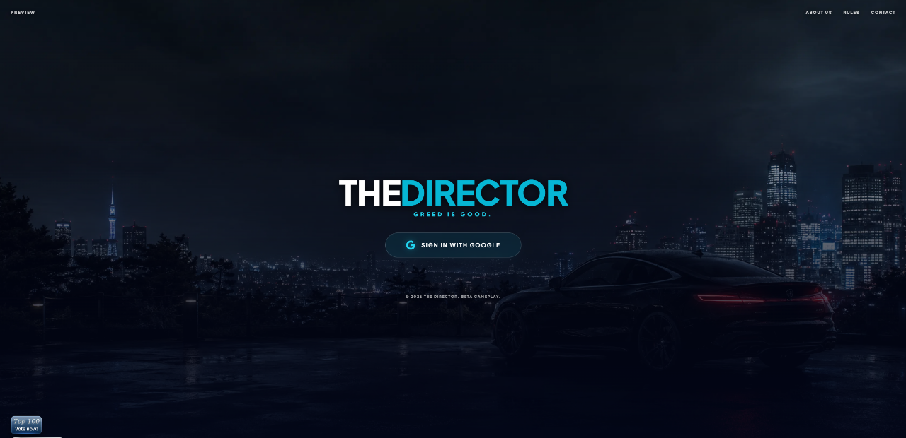
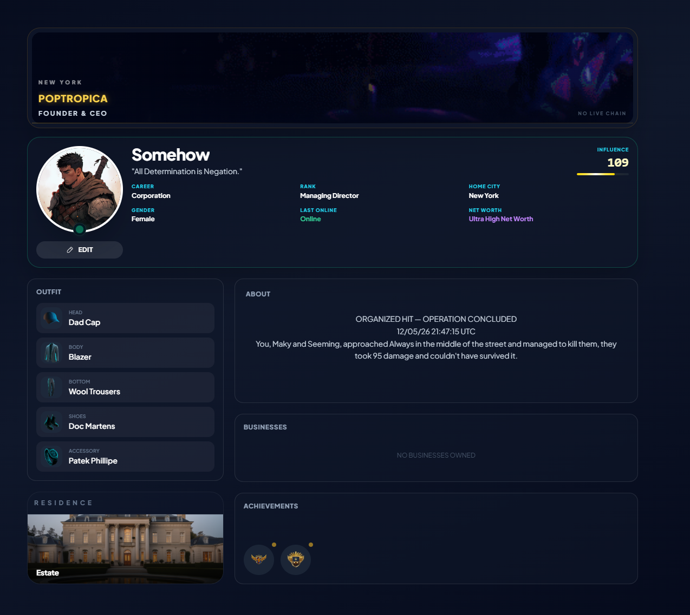
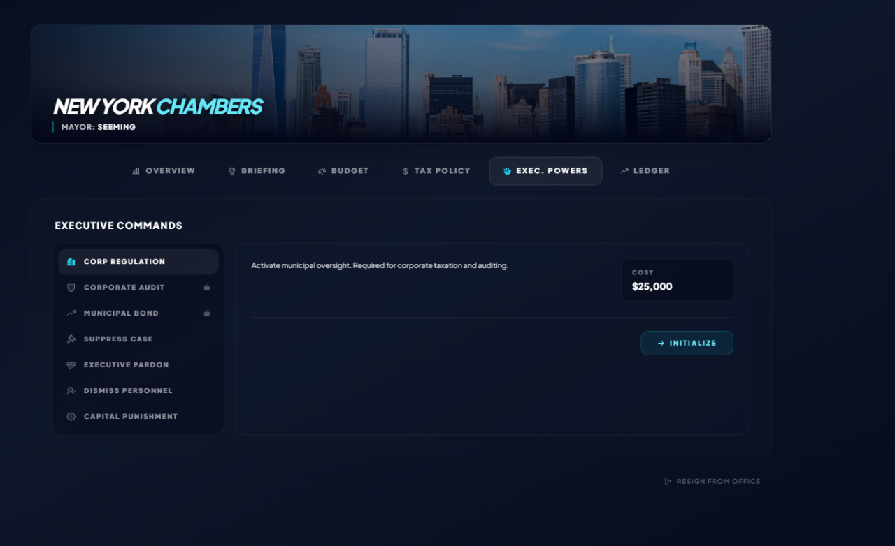
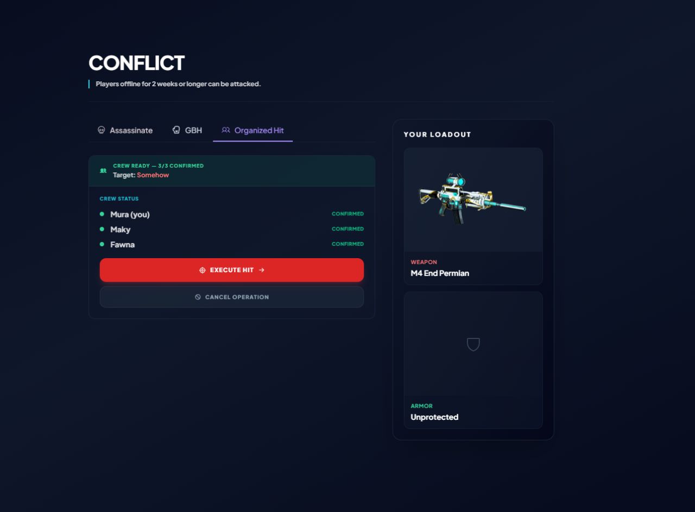
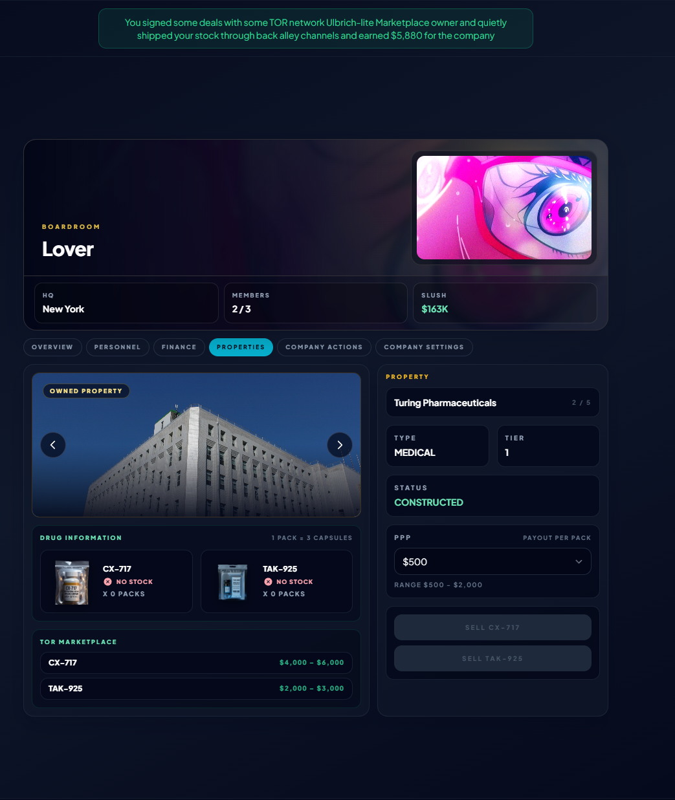
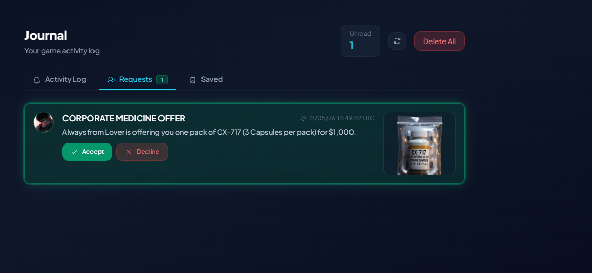

The Director is a fully feature complete PHP game i spent about 3 months of my life working on.

It's got in depth careers and jobs  ( lawyer, judge, banker), crimes, complex business and policing systems, arrests, elections, character histories, a corporate ladder and much more

Stack is Laravel, React, inertia, redis and postgresql. 
 


## Screenshots
















## Getting started

```bash
composer install
npm install

cp .env.example .env
php artisan key:generate

# create the database, then:
php artisan migrate --seed

npm run dev
php artisan serve
```

Make sure your env is setup properly.

Google OAuth is the only login method. Create OAuth credentials in the Google Cloud
Console and set `GOOGLE_CLIENT_ID` / `GOOGLE_CLIENT_SECRET` in `.env`, with the
redirect URI pointing at `/auth/google/callback`.

In local development (`APP_ENV=local`) a `/dev-login` route is available that
bypasses OAuth.

I'd recommend using supabase or neon.  Game also uses scheduled jobs using  pg_cron. 

Many of the game's images are hosted on my cloud storage,  My discord is makimura.dev, i can answer any questions you have or if you want a full copy of all the images. 


